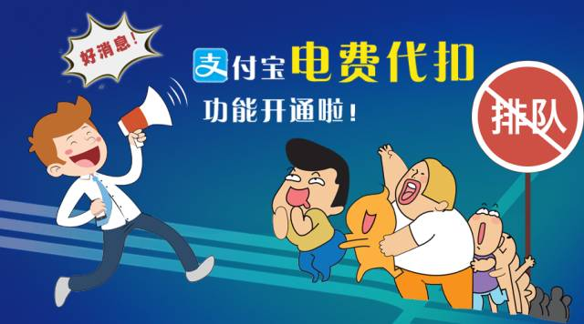

# 区块链--光明中成长

过了几天，又看到科长的嘴合不拢了，一看就是有好事。

王科见我过来，立刻说：“小李，过来。”

我笑嘻嘻的走过去，“今天又有什么好事？”

“前几天你给那5个QQ号，腾讯那边给出具体信息了。感觉年前抓到两三个很容易，哈哈，今年的指标我们可是超额完成啊。放心，今年的优秀肯定少不了你的。”

“真的？谢谢科长。”心想，虽然最后没有抓到最大的那条鱼，但现在抓到的几个人也算是大案了。

“继续去调查这条线吧，要是真能挖出大鱼你就出名啦！”

“好。”我也乐得去追查这些东西。一方面是只有几天我就抓出5名毒贩，这种成绩是以前难以想象的。另一方面，虚拟货币，区块链，像一个黑洞一样深深的吸引了我。

但我知道，这条路并不容易。

刘磊的话给了我很大的启示：我从一开始就带着一种恶意来看虚拟货币，看区块链。所以自己也用一种厌恶的态度研究这项技术。或许这种厌恶的态度可以让我更好的打击犯罪，但却没有办法让我更了解区块链这个世界。所以我开始用一种更平和的心态去了解区块链。

虚拟货币一种先被少数人认可，后又被全民热炒的东西啊，仅仅因为政府的否定就一无是处了吗？我从心里也慢慢作为一个普通人了解起虚拟货币来。

我发现，在全民热炒虚拟货币时，有一个概念被人提及的最多。即使到了今天，各地政府仍旧在支持其发展，这个概念就是**区块链**。

之前我对区块链的了解只限于Vitalik Buterin所说的，**区块链是一台永不停机的世界电脑**的说法。随着我看到的资料越来越多，才发现Vitalik Buterin的这个比喻真是非常之恰当，是一个对区块链有最深入的了解的人才能想出来的生动比喻。可能也正是由于这一点吧，很多人把Vitalik Buterin称为V神。

一接触区块链，大家可能最早了解到的就是什么非对称加密，什么哈希算法，什么共识机制之类的。但在我一个非计算机专业的人看来，那些都是细支末节。那些什么我也看不懂的技术，只是让这一台世界电脑正常运行，记录的数据不冲突的工具。这台世界电脑，才是区块链世界的真正核心。

我最终并不想成为一名区块链技术员，而是了解与使用区块链技术。所以，在抛开那些技术细节之后，整个区块链就明朗起来。我也终于能够理解，为什么会有那么多人，尤其还有很多很有见识很广的人都对区块链特别看好。在我看来，主要有两个关键字：**通证经济和智能合约**。

很多人鼓吹区块链将改变生产关系，造成世界的巨大变革，主要就是从**通证经济**这一点出发的。

> “通证经济”是基于区块链技术，以通证（虚拟货币）来界定分配内在权益、并使用通证来实现经济激励的新经济范式。

通证经济虽然是个新名词，但他的概念并不是什么新概念。通证经济是股份制的一种延伸，当然也有人说通证经济会迫使股份制公司的“消亡与重生”，并其实通证经济并没有那么神秘。

我认为把通证经济的精髓发挥到极致，并把公司做大的最好案例是一个1987就成立，已经不仅仅是世界500强的企业。听到我的描述，大家肯定一下子就想到了华为那个蛋疼的广告语。对，华为是通证经济能够达到的顶峰。

人们将华为的股份制称为“人人股份制”，在我看来是一种不完整的通证经济的完美应用。“人人股份制”说的简单点就是如果你为华为做出了贡献，那么华为会和你签订一份内部协议，你会占有公司的一定股份，参与公司的分红。

这不就是通证经济的精髓嘛。不同的通证经济模型加入了股权自由交易、参与公司决策、股权获得规则更加透明等特征。这些特征可能华为不是没有想过，但这些特征很有可能会导致一个公司无法做大做强。

例如股权参与公司决策这一点争议性就非常大。其支持者认为股权的持有者本身就会为公司的利益考虑，会倾向于做对公司更有利的事。其反对者认为这样极有可能会使公司进入权力斗争的漩涡，这样的例子不胜枚举。

至于股权的获得规则更加透明就更具有争议性了，通证经济的一在痛点就是“羊毛党”。“羊毛党”就是那些做着从符合规则，却未必有利公司发展的事来获得股权的人。只要规则更加透明、去中心化，那么“羊毛党”就几乎无法避免。

通证经济只是把华为的“人人股份制”中的股份合同换成了虚拟货币啊，所以区块链也要好好向华为取经。

**智能合约**也不是什么新玩意。大家都知道警察工作很忙，有时都没有时间关注自己的水电费，所以我的同事几乎所有人都开通了支付宝的“电费代扣”业务。根据智能合约的定义，“电费代扣”业务就是一个典型的智能合约。不过这个智能合约依托于“支付宝”，而区块链的智能合约直接就依托于区块链这台“世界电脑”。

从技术上讲，区块链这台世界电脑比支付宝这样的第三方更加可信。所以，智能合约在区块链世界中达到充分的肯定。特别是在一些赌博类的应用中，特别受欢迎。赌博或者说博彩中虽然中奖规则透明，但人们总担心暗箱操作。有了智能合约，大家把规则写入到区块链这台世界电脑中，公开透明，任何人都不能更改，所以更容易取得赌徒们的信任。

**越了解区块链，我怎么觉得我的警察职业大有可为呢？！**

越来越了解区块链，越觉得区块链还只处在初级阶段。现在区块链的应用就集中在金融（特别是交易所）、追溯、游戏等方面，非常局限。

### 引用

1、[区块链和通证经济（token economy）：股份制公司的消亡与重生 - 知乎](https://zhuanlan.zhihu.com/p/33468418)

2、[【股权】华为的股权结构](http://www.sohu.com/a/146175963_498757)

3、[如何看待公司员工股份制？ - 知乎](https://www.zhihu.com/question/20988312)

4、[股份制Token化，“通证经济”将会改变整个金融格局](http://www.twoeggz.com/news/10217725.html)

5、[区块链和通证经济（token economy）：股份制公司的消亡与重生 - 知乎](https://zhuanlan.zhihu.com/p/33468418)

6、[代币性经济 - 维基百科，自由的百科全书](https://zh.wikipedia.org/wiki/通证经济)

